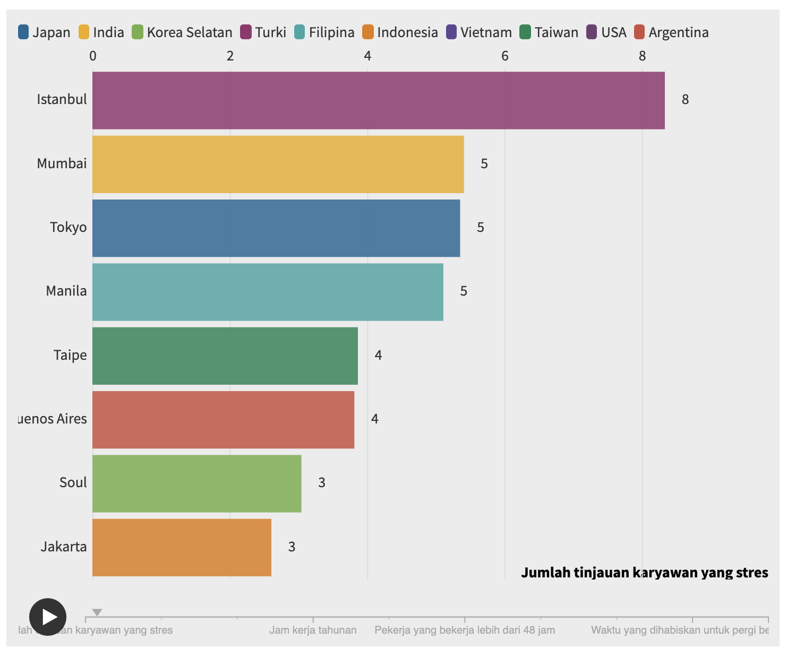
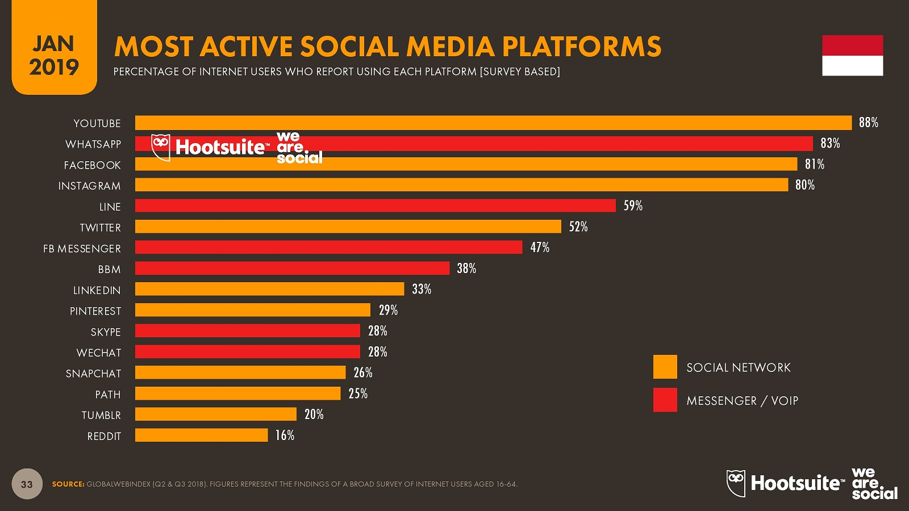

```{r setup, include=FALSE}
knitr::opts_chunk$set(echo = TRUE)
```


# Background

Stress is a feeling of emotional or physical tension. It can come from any event or thought that makes you feel frustrated, angry, or nervous. Stress is your body's reaction to a challenge or demand. In short bursts, stress can be positive, such as when it helps you avoid danger or meet a deadline. But when stress lasts for a long time, it may harm your health.   

From this paper [source](https://www.ncbi.nlm.nih.gov/pmc/articles/PMC5225218/) Stress in some level have crucial association with mood levels, especially stress with high level really contribute to mood swing. This paper focusly in adult age, it mean can happen in productively working ages.   

Most of working people life in big city, one of them is Jakarta. Based in this source [link](https://data.tempo.co/read/594/jakarta-kota-dengan-tingkat-stress-ke-enam-dunia) Jakarta is 6th position for highest stress city in the world, we can take look in this chart:

```{r fig.align="center", echo=FALSE}

```

In this project i try to help people have mood swing or bad mood, to make them get mood booster and make them feel better. So how to help stress people to change mood?. First i should to get where people express they mood, so it should be social media.

```{r fig.align="center", echo=FALSE}

```

Based on this chart and accessible data we can, twitter is social media suitable in this project. Twitter have open API, that give us access to read users update status and we can analyze their mood based on their update status.   

I will try use sentiment analyze and categorize their update status, so i will try to guess what is their mood based on update status. 

After we get people expression, next how we help to change their mood? Listening music, is one of the best method to help people change their mood and it can help them release their stress. I will try to suggest which music can make them more better, later it can be playlist and their can choose genre to specify which genre their like and i try to suggest which music can help them.

# Pre processing

We can get audio feature information for each track, and access very easy we can use this [Api link](https://developer.spotify.com/documentation/web-api/reference/tracks/get-audio-features/). In this example i will using spotify data-set from API from this source [kaggle](https://www.kaggle.com/zaheenhamidani/ultimate-spotify-tracks-db).

```{r message=FALSE}
library(tidyverse)
library(ggplot2)
library(GGally)
```


```{r message=FALSE}
tracks <- read_csv("data/SpotifyFeatures.csv")
```

Observe structure and preview imported dataset

```{r}
glimpse(tracks)
```

Variable Explanation:   
1. `genre` : Track genre   
2. `artist_name` : Artist name   
3. `track_name` : Title of track   
4. `track_id` : The Spotify ID for the track.   
5. `popularity` : Popularity rate (1-100)   
6. `acousticness` : A confidence measure from 0.0 to 1.0 of whether the track is acoustic. 1.0 represents high confidence the track is acoustic.   
7. `danceability` : Danceability describes how suitable a track is for dancing based on a combination of musical elements including tempo, rhythm stability, beat strength, and overall regularity. A value of 0.0 is least danceable and 1.0.   
8. `duration_ms` : The duration of the track in milliseconds.   
9. `energy` : 	Energy is a measure from 0.0 to 1.0 and represents a perceptual measure of intensity and activity. Typically, energetic tracks feel fast, loud, and noisy. For example, death metal has high energy, while a Bach prelude scores low on the scale.   
10. `instrumentalness` : Predicts whether a track contains no vocals. “Ooh” and “aah” sounds are treated as instrumental in this context. Rap or spoken word tracks are clearly “vocal”. The closer the instrumentalness value is to 1.0, the greater likelihood the track contains no vocal content. Values above 0.5 are intended to represent instrumental tracks, but confidence is higher as the value approaches 1.0.   
11. `key` : The estimated overall key of the track. Integers map to pitches using standard Pitch Class notation . E.g. 0 = C, 1 = C♯/D♭, 2 = D, and so on. If no key was detected, the value is -1.   
12. `liveness` : 	Detects the presence of an audience in the recording. Higher liveness values represent an increased probability that the track was performed live. A value above 0.8 provides strong likelihood that the track is live.   
13. `loudness` : The overall loudness of a track in decibels (dB). Loudness values are averaged across the entire track and are useful for comparing relative loudness of tracks.   
14. `mode` : 	Mode indicates the modality (major or minor) of a track, the type of scale from which its melodic content is derived. Major is represented by 1 and minor is 0.   
15. `speechiness` : Speechiness detects the presence of spoken words in a track. The more exclusively speech-like the recording (e.g. talk show, audio book, poetry), the closer to 1.0 the attribute value. Values above 0.66 describe tracks that are probably made entirely of spoken words. Values between 0.33 and 0.66 describe tracks that may contain both music and speech, either in sections or layered, including such cases as rap music. Values below 0.33 most likely represent music and other non-speech-like tracks.   
16, `tempo` : The overall estimated tempo of a track in beats per minute (BPM). In musical terminology, tempo is the speed or pace of a given piece and derives directly from the average beat duration.   
17. `time_signature` : 	An estimated overall time signature of a track. The time signature (meter) is a notational convention to specify how many beats are in each bar (or measure).   
18. `valence` : A measure from 0.0 to 1.0 describing the musical positiveness conveyed by a track. Tracks with high valence sound more positive (e.g. happy, cheerful, euphoric), while tracks with low valence sound more negative (e.g. sad, depressed, angry).  

First of all, we would check NA or Empty value of each variable, We didn't find any NA inside data

```{r}
colSums(is.na(tracks))
```

Some variable have wrong type data, we need to convert the data type:

* `genre` : to factor   
* `key` : to factor   
* `genre` : to factor   
* `mode`: to factor

```{r}
tracks <- tracks  %>% 
                  mutate(genre = as.factor(genre),
                  key = as.factor(key),
                  genre = as.factor(str_replace_all(genre, "[[:punct:]]", "")),
                  mode = as.factor(mode))
```


# Data Exploration

We can say `valence` variable that can help us to predict one track can be more cheerful (positive) or can be sad (negative). let see the distribution of valance in our data-set.

```{r}
tracks %>% 
  ggplot(aes(x = valence)) +
  geom_histogram(binwidth=0.09,color="#e9ecef", fill = "#69b3a2", alpha=0.9, position = "identity") +
  theme_minimal() +
  labs(fill="")
```

```{r}
summary(tracks$valence)
```

I put summary after the histogram, because we found around 10.000 tracks have valence around 0 value and in summary we can see min of valance is 0.0, it can mean the song is really negative, or spotify platform still have some miss read valance for valance variable.   

From data-set we have, we try to visualize valence grouping with genre. This visualize can help us know, which genre that can give more positive or negative.   

```{r}
genre_valence <- tracks %>% select(valence, genre) %>% group_by(genre) %>% summarise("average_valence" = mean(valence))

genre_valence %>% 
ggplot(aes(reorder(genre,average_valence),average_valence)) +
  geom_col(aes(fill = average_valence)) +
  scale_fill_gradient(low="lightblue",
                        high="blue") +
  coord_flip() +
  theme_minimal() +
  theme(
    legend.position = "none"
  ) +
  labs(
    y = "Average valence",
    x = "Genre"
  )
```

Based on visualize above, we can see Reggae is music genre with highest average valence. It mean genre is the most genre can bring more positiveness and in our case it can help people release their stress.   

From data-set we get, we found we have `genre` wish it we can group our data base on it. We will visualize data, Later it can help us for choose genre is really popular, so if people don't like any genre we suggest we can give them by popularity

```{r}
genre_popularity <- tracks %>% select(popularity, genre) %>% group_by(genre) %>% summarise("average_popularity" = round(mean(popularity)))

genre_popularity %>% 
ggplot(aes(reorder(genre,average_popularity),average_popularity)) +
  geom_col(aes(fill = average_popularity)) +
  scale_fill_gradient(low="orange",
                        high="red") +
  coord_flip() +
  theme_minimal() +
  theme(
    legend.position = "none",
    
  ) +
  labs(
    y = "Average popularity",
    x = "Genre"
  )
  
```

I will visualize correlation plot that shows correlation for every numerical variable. `Valence` is variable that we will pay attention more than others, because this variable intepret how music can be cheerful or can be sad. Based on visualize, valence have correlation with most of others variable, only speechiness, liveness, and popularity have low correlation.

```{r}
ggcorr(tracks, low = "blue", high = "red")
```


# Summary

Data we have from spotify, it really help us to suggest music can give stress people to boost their mood. One of variable that can really help us is `valence` from 0 - 1 it can help us to know which tracks have more positive or negative audio. This audio feature `valence` have correlation with lot of variable in our data, so it will really help us later to profiling which song can strongly positive or negative to suggest people who have bad mood.